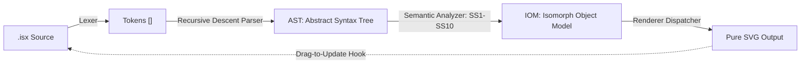

<div align="center">
  

  # ✦ Isomorph ✦

  **A formally specified domain-specific language for software diagramming with bidirectional text–visual synchronization.**
  
  [](https://github.com/team02-faf241/isomorph/actions/workflows/ci.yml)
  [](LICENSE)
  [](https://www.typescriptlang.org/)
  [](https://reactjs.org/)
  [](https://codemirror.net/)
  [](#-testing--validation)

  [**Live Demo**](https://team02-faf241.github.io/isomorph/) • [**Language Spec**](grammar/Isomorph.g4) • [**Examples**](examples/) • [**Contributing**](CONTRIBUTING.md)
</div>

<br/>

> **Isomorph** lets you write structured text on the left and see a live-rendered diagram on the right. But unlike other text-to-diagram tools, Isomorph is **bidirectional**. Drag an entity on the visual canvas, and your source code updates instantly. 

<br/>

## Key Features

- **Bidirectional Synchronization:** The source code *is* the diagram and the diagram *is* the source code. Moving visuals in the canvas writes `@Entity at (x,y)` layout rules straight back to your code.
- **Formally Specified Grammar:** Defined by a strict, unambiguous [ANTLR4 grammar](grammar/Isomorph.g4) featuring **55 production rules** and **66 token kinds**.
- **Static Semantic Analysis:** Validates your designs against 10 strict semantic rules (SS-1 to SS-10)—catching circular inheritance, duplicate methods, and invalid endpoints before rendering.
- **Pure Zero-Dependency SVG Rendering:** High-performance, template-based SVG generation directly from the Abstract Syntax Tree.
- **Modern Editing Experience:** Embedded CodeMirror 6 with custom syntax highlighting (`.isx` format).
- **Version Control Friendly:** Layouts are saved as standard text anchors, ensuring zero metadata drift when pushing to Git.

---

## Supported Diagram Types

Isomorph’s standard library handles an array of software architecture blueprints:

| Diagram | Support | Renderer Module | Documentation |
|:---|:---:|:---|:---|
| **Class Diagrams** | ✅ | `class-renderer.ts` | [class.md](docs/class.md) |
| **Use Case Diagrams** | ✅ | `usecase-renderer.ts` | [use-case.md](docs/use-case.md) |
| **Component Diagrams** | ✅ | `component-renderer.ts` | [component.md](docs/component.md) |
| **Sequence Diagrams** | ✅ | `sequence-renderer.ts` | [sequence.md](docs/sequence.md) |
| **State Diagrams** | ✅ | `state-renderer.ts` | [state.md](docs/state.md) |
| **Flow/Activity Diagrams**| ✅ | `flow-renderer.ts` | [activity.md](docs/activity.md) |
| **Collaboration** | ✅ | `collaboration-renderer.ts`| [collaboration.md](docs/collaboration.md) |
| **Deployment Diagrams** | ✅ | `component-renderer.ts` (shared deployment path) | [deployment.md](docs/deployment.md) |

---

## 💻 The `.isx` Language Syntax

Isomorph files natively end in **`.isx`**. The syntax looks like an elegant hybrid between typescript interfaces and plantUML definitions.

```isomorph
diagram Library : class {

  abstract class Book <<Entity>> implements Borrowable {
    + title : string
    + isbn  : string
    - stock : int = 0
    + checkOut(user: string) : bool
  }

  class Library {
    + name : string
    + addBook(book: Book) : void
    + search(query: string) : List<Book>
  }

  interface Borrowable {
    + borrow(user: string) : void
    + return() : void
  }

  enum BookStatus {
    AVAILABLE
    CHECKED_OUT
    RESERVED
  }

  Library --* Book [label="contains", toMult="1..*"]
  Book ..|> Borrowable

  // Bidirectional layout anchors — updated continuously as you drag on canvas!
  @Book       at (100, 130)
  @Library    at (400, 130)
  @Borrowable at (100, 360)
  @BookStatus at (400, 360)
}
```

---

## Architecture & Pipeline

Isomorph parses source code through a totally pure, non-throwing functional pipeline, feeding eventually into the React View rendering SVGs.



### Compiler Phases:
1. **Lexing:** Hand-crafted, high-performance tokenizer (66 tokens).
2. **Parsing:** Recursive descent `LL(1)` parser capturing exactly 22 abstract tree constructs (with structural span tracking).
3. **Translational Semantics:** The source is mapped into the **Isomorph Object Model (IOM)**.
4. **Rendering:** Pure SVG render pipelines (`*-renderer.ts`) map the IOM directly to layout nodes.

---

## Static Semantics & Safety

Before any rendering occurs, the AST is validated against **10 core Rules (SS-1 to SS-10)** to enforce architectural correctness:

| Rule   | Constraint Evaluated               | Protective Function                                          |
|--------|------------------------------------|--------------------------------------------------------------|
| **SS-1** | Entity name uniqueness             | Rejects duplicate entities (e.g. two `UserService` classes).   |
| **SS-2** | Member name uniqueness          | Prevents duplicate fields/methods within the same object.      |
| **SS-3** | Relation endpoint resolution       | Detects edges pointing to non-existent namespaces.            |
| **SS-4** | Enum non-emptiness                 | Blocks `enum {}` declarations.                                |
| **SS-5** | Interface field constraints        | Prevents initializations / default values inside interfaces.  |
| **SS-6** | Acyclic inheritance constraints    | Fails on cyclic graphs (`class A extends B; class B extends A`). |
| **SS-7** | Style target validity              | Prevents styling operations on non-existent elements.          |
| **SS-8** | Enum value uniqueness              | Stops repeating internal values in Enums.                      |
| **SS-9** | Diagram kind compatibility         | Enforces correct blocks per diagram (e.g., no `actor` in `class`). |
| **SS-10**| Layout reference validity          | Ensures visual coordinate mapping `@Ghost at (x,y)` exists.    |

---

## Technology Stack

| Domain                  | Technology                                                                                                 |
|-------------------------|------------------------------------------------------------------------------------------------------------|
| **Language & Typing**   | TypeScript 5.7 *(Strict Mode)*                                                                             |
| **Bundling & Build**    | Vite 6.x                                                                                                   |
| **UI Shell**            | React 18.x                                                                                                 |
| **Code Editor**         | CodeMirror 6 *(Custom Lang Plugin)*                                                                        |
| **Reference Grammar**   | ANTLR4 (`Isomorph.g4`)                                                                                     |
| **Unit Testing**        | Vitest 2.x + jsdom                                                                                         |

---

## Testing & Validation

The core of the Isomorph parser and semantics analyzer passes 84 isolated tests natively.

```bash
# Run the test suite
npm run test

# Additional QA scripts
npm run test:watch     # Run in watch mode
npm run test:coverage  # Display coverage statistics
npm run typecheck      # Trigger strict TypeScript linting (tsc --noEmit)
```

**Coverage Breakdown:**
- `lexer.test.ts`: Keywords, operators, literals, error recovery (24 tests)
- `parser.test.ts`: Entities, relationships, generative types (28 tests)
- `semantics.test.ts`: IOM verification and SS-1 through SS-10 constraint validation (32 tests)

---

## Contributing

Contributions are heavily encouraged! To learn how the codebase is structured, conventions for feature branches, and the pull-request process, please see our [**Contribution Guidelines**](CONTRIBUTING.md).

---

## Meet the Team (FAF-241)

| Name                      | Core Role                                |
|---------------------------|------------------------------------------|
| **Lucian-Adrian Gavril**  | Team Lead / Technical Writer             |
| **Aurelian-Mihai Tihon**  | Technical Lead / Language Engineer       |
| **Iulian Pavlov**         | Documentation / Canvas Rendering         |
| **Nichita Tcacenco**      | Deployment / Quality Assurance           |

**Mentor**: Fiștic Cristofor  
**Institution**: Technical University of Moldova  
**License**: Isomorph is released under the [MIT License](LICENSE).
