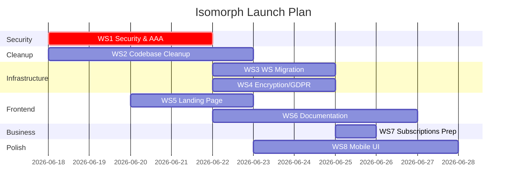

# Isomorph — Master Implementation Plan

> **Created**: 2026-06-17  
> **Scope**: All remaining work before public launch  
> **Priority Order**: Security → Cleanup → Infra Migration → Encryption → Landing → Docs → Subscriptions → Mobile → OSS

---

## Table of Contents

1. [Workstream 1: Security & AAA Hardening](#workstream-1-security--aaa-hardening)
2. [Workstream 2: Codebase Cleanup & Refactoring](#workstream-2-codebase-cleanup--refactoring)
3. [Workstream 3: WebSocket Migration (y-supabase)](#workstream-3-websocket-migration-y-supabase)
4. [Workstream 4: Encryption, GDPR & Data Privacy](#workstream-4-encryption-gdpr--data-privacy)
5. [Workstream 5: Landing Page](#workstream-5-landing-page)
6. [Workstream 6: Documentation Site](#workstream-6-documentation-site)
7. [Workstream 7: Subscriptions & Payments](#workstream-7-subscriptions--payments)
8. [Workstream 8: Mobile UI Improvements](#workstream-8-mobile-ui-improvements)
9. [Future: Open-Source Edition](#future-open-source-edition)
10. [Cross-Cutting: Supabase Migration & Self-Hosting Prep](#cross-cutting-supabase-migration--self-hosting-prep)

---

## Workstream 1: Security & AAA Hardening

**Goal:** Lock down every authentication, authorization, and accounting surface so the system is production-secure and follows the AAA framework end to end.

> [!IMPORTANT]
> This workstream should be completed **first** because every other workstream builds on top of a secure foundation. Deploying a landing page or payments without fixing these issues would be irresponsible.

---

### 1.1 Authentication Fixes

#### 1.1.1 Fix `/api/check-email` Endpoint (Email Enumeration)

**Problem:** The current endpoint fetches ALL users via `supabase.auth.admin.listUsers()` and returns `{ exists: true/false }`. This is both an email enumeration vector and doesn't scale.

**Solution:** Replace with Supabase Admin's `getUserByEmail()` + rate limiting, and make the response opaque.

##### [MODIFY] [server/index.js](file:///c:/Users/0xAu/Documents/School/University/Year%202/PBL/Semester%202%20(Isomorph)/code/isomorph/server/index.js)
```diff
- const { data, error } = await supabase.auth.admin.listUsers();
- const exists = data.users.some(u => u.email && u.email.toLowerCase() === cleanEmail);
+ // Rate limiting: track IPs, max 5 checks per minute
+ const { data: { users }, error } = await supabase.auth.admin.listUsers({
+   filter: `email.eq.${cleanEmail}`,
+   perPage: 1,
+ });
+ const exists = users && users.length > 0;
```

Alternatively, the cleanest fix is to **remove this endpoint entirely** and handle duplicate-email suppression differently:

**Option A (Recommended):** Let Supabase handle it. Configure Supabase Auth settings:
- Dashboard → Auth → Settings → Enable "Confirm email" 
- Dashboard → Auth → Settings → Set "Confirm email change" = true
- Supabase already suppresses duplicate confirmation emails when the user hasn't verified yet — it just returns an error that you can catch and display the same success message regardless.

**Option B:** If you keep the endpoint, add these protections:
```javascript
// Add at top of server/index.js
const rateLimitMap = new Map(); // IP -> { count, resetAt }
const RATE_LIMIT = 5; // max attempts
const RATE_WINDOW = 60_000; // 1 minute

function checkRateLimit(ip) {
  const now = Date.now();
  const entry = rateLimitMap.get(ip);
  if (!entry || now > entry.resetAt) {
    rateLimitMap.set(ip, { count: 1, resetAt: now + RATE_WINDOW });
    return true;
  }
  if (entry.count >= RATE_LIMIT) return false;
  entry.count++;
  return true;
}
```

#### 1.1.2 Supabase Key Migration

**Status:** You're already using `sb_publishable_` key ✅. Now complete the migration:

##### [MODIFY] [.env.example](file:///c:/Users/0xAu/Documents/School/University/Year%202/PBL/Semester%202%20(Isomorph)/code/isomorph/.env.example)
```diff
- VITE_SUPABASE_ANON_KEY=your-supabase-anon-key
+ VITE_SUPABASE_ANON_KEY=sb_publishable_your-key-here
```

##### [MODIFY] [server/.env.example](file:///c:/Users/0xAu/Documents/School/University/Year%202/PBL/Semester%202%20(Isomorph)/code/isomorph/server/.env.example)
```diff
- SUPABASE_SERVICE_ROLE_KEY=your_service_role_key_here
+ SUPABASE_SECRET_KEY=sb_secret_your-key-here
```

Update all references in server code from `SUPABASE_SERVICE_ROLE_KEY` → `SUPABASE_SECRET_KEY`.

#### 1.1.3 Scrub Git History

Run BFG Repo-Cleaner to remove the old leaked keys from commit `3b603677`:
```bash
# Download BFG
java -jar bfg.jar --replace-text passwords.txt isomorph.git
git reflog expire --expire=now --all && git gc --prune=now --aggressive
git push --force
```

Where `passwords.txt` contains the old key values to scrub.

> [!WARNING]
> Force-pushing rewrites history. All collaborators must re-clone after this.

---

### 1.2 Authorization Fixes

#### 1.2.1 WebSocket Authentication

**Problem:** Anyone can connect to any Y.Doc room without authentication. No JWT validation.

##### [MODIFY] [server/index.js](file:///c:/Users/0xAu/Documents/School/University/Year%202/PBL/Semester%202%20(Isomorph)/code/isomorph/server/index.js)

Add JWT verification on WebSocket handshake:

```javascript
const url = require('url');
const jwt = require('jsonwebtoken');

// Get JWT secret from Supabase dashboard → Settings → API → JWT Secret
const JWT_SECRET = process.env.SUPABASE_JWT_SECRET;

wss.on('connection', (conn, req) => {
  const parsedUrl = url.parse(req.url, true);
  const token = parsedUrl.query.token;
  
  // Allow anonymous access for share links (they pass a share token instead)
  if (token && token.startsWith('anon:')) {
    // Validate anonymous share token against DB
    console.log('Anonymous connection accepted');
    setupWSConnection(conn, req, { gc: true });
    return;
  }
  
  if (!token) {
    conn.close(4001, 'Authentication required');
    return;
  }
  
  try {
    const decoded = jwt.verify(token, JWT_SECRET);
    console.log(`Authenticated connection: ${decoded.sub}`);
    setupWSConnection(conn, req, { gc: true });
  } catch (err) {
    conn.close(4003, 'Invalid token');
  }
});
```

##### [MODIFY] [src/lib/collaboration.ts](file:///c:/Users/0xAu/Documents/School/University/Year%202/PBL/Semester%202%20(Isomorph)/code/isomorph/src/lib/collaboration.ts)

Pass JWT token in WebSocket URL:

```typescript
public connect(roomName: string, userName: string, cursorColor: string, accessToken?: string) {
  // ...existing logic...
  const wsUrl = accessToken 
    ? `${COLLAB_SERVER_URL}/${roomName}?token=${encodeURIComponent(accessToken)}`
    : COLLAB_SERVER_URL;
    
  this.provider = new WebsocketProvider(wsUrl, roomName, this.doc, {
    connect: true,
    params: { token: accessToken || '' },
  });
  // ...
}
```

#### 1.2.2 Concurrency Limit Enforcement (8 users)

##### [MODIFY] [server/index.js](file:///c:/Users/0xAu/Documents/School/University/Year%202/PBL/Semester%202%20(Isomorph)/code/isomorph/server/index.js)

```javascript
const roomConnections = new Map(); // roomName -> Set<WebSocket>
const MAX_CONNECTIONS_PER_ROOM = 8;

wss.on('connection', (conn, req) => {
  const roomName = /* extract from URL path */;
  
  const roomSet = roomConnections.get(roomName) || new Set();
  if (roomSet.size >= MAX_CONNECTIONS_PER_ROOM) {
    conn.close(4029, 'Room full (8/8)');
    return;
  }
  
  roomSet.add(conn);
  roomConnections.set(roomName, roomSet);
  
  conn.on('close', () => {
    roomSet.delete(conn);
    if (roomSet.size === 0) roomConnections.delete(roomName);
  });
  
  setupWSConnection(conn, req, { gc: true });
});
```

#### 1.2.3 Fix Avatar Storage Policy

##### [NEW] `supabase/migrations/011_fix_avatar_policy.sql`
```sql
-- Drop overly permissive policies
DROP POLICY IF EXISTS "Anyone can upload an avatar." ON storage.objects;
DROP POLICY IF EXISTS "Anyone can update their avatar." ON storage.objects;

-- Users can only upload to their own folder
CREATE POLICY "Users can upload own avatar."
  ON storage.objects FOR INSERT
  WITH CHECK (
    bucket_id = 'avatars' AND
    auth.uid()::text = (storage.foldername(name))[1]
  );

CREATE POLICY "Users can update own avatar."
  ON storage.objects FOR UPDATE
  USING (
    bucket_id = 'avatars' AND
    auth.uid()::text = (storage.foldername(name))[1]
  );

CREATE POLICY "Users can delete own avatar."
  ON storage.objects FOR DELETE
  USING (
    bucket_id = 'avatars' AND
    auth.uid()::text = (storage.foldername(name))[1]
  );
```

#### 1.2.4 Fix Anonymous Session RLS

##### [NEW] `supabase/migrations/012_fix_anonymous_sessions_rls.sql`
```sql
DROP POLICY IF EXISTS "Anonymous sessions are viewable by everyone in the project" ON public.anonymous_sessions;
DROP POLICY IF EXISTS "Users can insert their anonymous session" ON public.anonymous_sessions;
DROP POLICY IF EXISTS "Users can update their anonymous session" ON public.anonymous_sessions;

-- Only viewable by project members
CREATE POLICY "Anon sessions viewable by project members"
  ON public.anonymous_sessions FOR SELECT
  USING (
    EXISTS (SELECT 1 FROM public.projects WHERE id = project_id AND owner_id = auth.uid()) OR
    EXISTS (SELECT 1 FROM public.project_access WHERE project_id = project_id AND user_id = auth.uid())
  );

-- Insert is still permissive (anonymous users need to create sessions)
CREATE POLICY "Anyone can create anonymous session"
  ON public.anonymous_sessions FOR INSERT
  WITH CHECK (true);

-- Only the session owner can update (matched by session_token check in app logic)
CREATE POLICY "Session owner can update"
  ON public.anonymous_sessions FOR UPDATE
  USING (true); -- App-level validation via session_token
```

#### 1.2.5 Share Link Token Security

##### [MODIFY] [src/lib/share-links.ts](file:///c:/Users/0xAu/Documents/School/University/Year%202/PBL/Semester%202%20(Isomorph)/code/isomorph/src/lib/share-links.ts)
```diff
- const token = Math.random().toString(36).substring(2, 15) + Math.random().toString(36).substring(2, 15);
+ const token = crypto.randomUUID().replace(/-/g, '') + crypto.randomUUID().replace(/-/g, '').slice(0, 8);
```

---

### 1.3 Accounting (Audit Trail)

#### 1.3.1 Audit Log Table

##### [NEW] `supabase/migrations/013_add_audit_log.sql`
```sql
CREATE TABLE public.audit_log (
  id uuid DEFAULT gen_random_uuid() PRIMARY KEY,
  user_id uuid REFERENCES auth.users(id) ON DELETE SET NULL,
  action text NOT NULL, -- 'login', 'logout', 'project_created', 'project_deleted', 'access_granted', 'access_revoked', 'diagram_saved', 'share_link_created', 'account_deleted', 'settings_changed'
  resource_type text, -- 'project', 'diagram', 'share_link', 'profile'
  resource_id uuid,
  metadata jsonb DEFAULT '{}',
  ip_address inet,
  user_agent text,
  created_at timestamptz DEFAULT now()
);

ALTER TABLE public.audit_log ENABLE ROW LEVEL SECURITY;

-- Insert-only for authenticated users
CREATE POLICY "Users can insert audit entries"
  ON public.audit_log FOR INSERT
  WITH CHECK (auth.uid() IS NOT NULL);

-- Users can read their own audit log
CREATE POLICY "Users can read own audit log"
  ON public.audit_log FOR SELECT
  USING (auth.uid() = user_id);

-- Index for fast queries
CREATE INDEX idx_audit_log_user_id ON public.audit_log(user_id);
CREATE INDEX idx_audit_log_action ON public.audit_log(action);
CREATE INDEX idx_audit_log_created_at ON public.audit_log(created_at DESC);
```

##### [NEW] `src/lib/audit.ts`
```typescript
import { supabase } from './supabase.js';

type AuditAction = 'login' | 'logout' | 'project_created' | 'project_deleted' | 
  'access_granted' | 'access_revoked' | 'diagram_saved' | 'share_link_created' | 
  'account_deleted' | 'settings_changed' | 'share_link_redeemed';

export async function logAudit(
  action: AuditAction,
  resourceType?: string,
  resourceId?: string,
  metadata?: Record<string, unknown>
): Promise<void> {
  try {
    await supabase.from('audit_log').insert({
      action,
      resource_type: resourceType,
      resource_id: resourceId,
      metadata,
      user_agent: navigator.userAgent,
    });
  } catch {
    // Silent fail — audit should never break the app
  }
}
```

#### 1.3.2 Wire Audit Calls Into Existing Code

Add `logAudit()` calls at every significant action point in App.tsx and lib files:
- Login/logout → `logAudit('login')` / `logAudit('logout')`
- Project/diagram CRUD → `logAudit('project_created', 'project', projectId)`
- Share link operations → `logAudit('share_link_created', 'share_link', linkId)`
- Access grants → `logAudit('access_granted', 'project', projectId, { grantedTo, role })`
- Account deletion → `logAudit('account_deleted')`

### 1.4 Server Hardening

#### 1.4.1 CORS Restriction

##### [MODIFY] [server/index.js](file:///c:/Users/0xAu/Documents/School/University/Year%202/PBL/Semester%202%20(Isomorph)/code/isomorph/server/index.js)
```diff
- response.setHeader('Access-Control-Allow-Origin', '*');
+ const allowedOrigins = (process.env.ALLOWED_ORIGINS || 'http://localhost:5173').split(',');
+ const origin = request.headers.origin;
+ if (allowedOrigins.includes(origin)) {
+   response.setHeader('Access-Control-Allow-Origin', origin);
+ }
```

#### 1.4.2 WSS Enforcement

When deployed, always use `wss://` (TLS) for WebSocket connections. Update:

##### [MODIFY] [.env.example](file:///c:/Users/0xAu/Documents/School/University/Year%202/PBL/Semester%202%20(Isomorph)/code/isomorph/.env.example)
```diff
- VITE_WS_URL=ws://localhost:1234
+ VITE_WS_URL=ws://localhost:1234
+ # Production: VITE_WS_URL=wss://collab.yourdomain.com
```

### Verification — Workstream 1
- [ ] `/api/check-email` no longer leaks email existence OR is removed
- [ ] WebSocket connections require JWT or valid share token
- [ ] Room rejects connection #9
- [ ] Avatar upload restricted to own user folder
- [ ] Share tokens use `crypto.randomUUID()`
- [ ] Audit log captures all critical actions
- [ ] CORS restricted to allowed origins
- [ ] `npm run build` passes
- [ ] All existing tests pass

---

## Workstream 2: Codebase Cleanup & Refactoring

**Goal:** Break up the 5,400-line God File, centralize types, add linting, and eliminate `any` types.

> [!NOTE]
> This workstream can run in parallel with Workstream 1 on a separate branch. Merge security fixes first.

---

### 2.1 Tooling Setup

#### [NEW] `.prettierrc`
```json
{
  "semi": true,
  "singleQuote": true,
  "tabWidth": 2,
  "trailingComma": "all",
  "printWidth": 120,
  "bracketSpacing": true
}
```

#### [NEW] `.eslintrc.cjs`
```javascript
module.exports = {
  root: true,
  env: { browser: true, es2022: true },
  extends: [
    'eslint:recommended',
    'plugin:@typescript-eslint/recommended',
    'plugin:react-hooks/recommended',
  ],
  parser: '@typescript-eslint/parser',
  parserOptions: { ecmaVersion: 'latest', sourceType: 'module' },
  plugins: ['@typescript-eslint', 'react-refresh'],
  rules: {
    '@typescript-eslint/no-explicit-any': 'warn',
    '@typescript-eslint/no-unused-vars': ['error', { argsIgnorePattern: '^_' }],
    'react-refresh/only-export-components': ['warn', { allowConstantExport: true }],
  },
};
```

### 2.2 Type Centralization

#### [NEW] `src/types/index.ts`
Extract and centralize all types currently scattered across lib files:

```typescript
// --- Auth & Profile ---
export interface Profile {
  id: string;
  username: string | null;
  full_name: string | null;
  avatar_url: string | null;
  updated_at: string | null;
  tier: UserTier;
  settings?: ProfileSettings;
}

export type UserTier = 'basic' | 'power' | 'enterprise';
export type AccessRole = 'owner' | 'editor' | 'commenter' | 'viewer';
export type ShareLinkRole = 'editor' | 'commenter' | 'viewer';

export interface ProfileSettings {
  cursor_colour?: string;
  theme?: 'light' | 'dark';
  telemetry_enabled?: boolean;
  // ...other settings
}

// --- Projects & Diagrams ---
export interface Project { /* ... */ }
export interface Diagram { /* ... */ }
export interface DiagramContent { source: string; /* other fields */ }
export interface DiagramHistory { /* ... */ }

// --- Collaboration ---
export interface ShareLink { /* ... */ }
export interface ProjectAccess { /* ... */ }
export interface Collaborator {
  clientId: number;
  name: string;
  color: string;
  avatarUrl: string | null;
  role: string;
}

// --- Workspace ---
export interface WorkspaceTab { /* move from App.tsx */ }
```

### 2.3 App.tsx Decomposition

Break `App.tsx` into these modules following `clean.md` Phase 2-4:

| New File | What to Extract | ~Lines |
|----------|----------------|--------|
| `src/types/index.ts` | All interfaces, type aliases | ~100 |
| `src/constants.ts` | `DIAGRAM_KINDS`, `REL_TOKENS_BY_KIND`, `ENTITY_KINDS_RX`, `TIER_LIMITS` | ~50 |
| `src/utils/source-manipulation.ts` | `findDiagramBlock`, `insertBeforeAnnotations`, `insertRelation`, `updateEntityPosition`, `updateRelationById`, etc. | ~400 |
| `src/utils/stencils.ts` | `getStencilsForKind()` with all SVG icons | ~150 |
| `src/utils/templates.ts` | `templateFor()` | ~40 |
| `src/utils/formatting.ts` | `formatDiagramSource()`, `sequenceToCollaborationSource()` | ~100 |
| `src/hooks/useWorkspace.ts` | Tab management state + logic | ~200 |
| `src/hooks/useKeyboardShortcuts.ts` | All `Ctrl+S/Z/Y/N/E/D` handlers | ~150 |
| `src/hooks/useCloudSync.ts` | Project loading, saving, history | ~200 |
| `src/hooks/useShareLink.ts` | Share link redemption logic | ~80 |
| `src/components/Toolbar.tsx` | Top toolbar rendering | ~200 |
| `src/components/Sidebar.tsx` | Shape stencil sidebar | ~150 |
| `src/components/StatusBar.tsx` | Bottom status bar | ~50 |
| `src/components/SettingsModal.tsx` | Settings modal (all tabs) | ~500 |
| `src/components/LibraryModal.tsx` | Library modal (My/Shared/Examples) | ~400 |
| `src/components/ExportModal.tsx` | Export modal | ~200 |
| `src/components/HistoryPane.tsx` | Version history sidebar | ~200 |
| `src/components/CollaboratorBar.tsx` | Collaborator avatars + dropdown | ~100 |

**Target:** App.tsx should be reduced to ~500-800 lines — just composition of hooks and components.

### 2.4 Eliminate `any` Types

| File | Current `any` | Replace With |
|------|--------------|-------------|
| `profile.ts` L10 | `settings?: any` | `settings?: ProfileSettings` |
| `projects.ts` L21 | `content: any` | `content: DiagramContent` |
| `projects.ts` L178 | `content: any` | `content: DiagramContent` |
| `telemetry.ts` L14 | `metadata: any` | `metadata: Record<string, unknown>` |
| `collaboration.ts` L10 | `provider: any` | `provider: WebsocketProvider \| null` |
| `access-control.ts` L31 | `as any as ProjectAccess[]` | Proper typed Supabase query |

### 2.5 Error Handling Centralization

#### [NEW] `src/lib/errors.ts`
```typescript
export class IsomorphError extends Error {
  constructor(
    message: string,
    public code: string,
    public userMessage: string, // i18n key for user-facing message
    public details?: unknown,
  ) {
    super(message);
    this.name = 'IsomorphError';
  }
}

export function handleSupabaseError(error: unknown, context: string): never {
  console.error(`[${context}]`, error);
  const msg = error instanceof Error ? error.message : 'Unknown error';
  throw new IsomorphError(msg, 'SUPABASE_ERROR', 'errors.generic', error);
}
```

### 2.6 i18n Hardcoded Strings

Fix the remaining hardcoded English strings:
- `App.tsx:3927` → `"No shared works"` → use `t('ui.no_shared_works')`
- `App.tsx:3294` → cursor description → use `t('settings.cursor_colour_desc')`
- `ShareModal.tsx:273` → `"Remove Access"` title → use `t('share.remove')`
- `App.tsx:4144` → account deletion warning → use `t('settings.delete_warning')`

### Verification — Workstream 2
- [ ] App.tsx < 800 lines
- [ ] No `any` types in `src/lib/`
- [ ] Prettier formats all files consistently
- [ ] ESLint passes with no errors
- [ ] All i18n strings use `t()` function
- [ ] `npm run build` passes
- [ ] All existing tests pass
- [ ] Manual smoke test: all modals, collaboration, save/load work

---

## Workstream 3: WebSocket Migration (y-supabase)

**Goal:** Eliminate the standalone Node.js WebSocket server and use Supabase Realtime for CRDT sync.

> [!IMPORTANT]
> **Decision Point: Keep `y-websocket` server vs. migrate to `y-supabase`?**
>
> | Criteria | Keep y-websocket | Migrate to y-supabase |
> |----------|-----------------|----------------------|
> | Separate server to host | ❌ Yes | ✅ No |
> | Scalability | Manual | Supabase-managed |
> | Self-hosting ready | ✅ Docker | ✅ Supabase stack |
> | Production-tested | ✅ Mature | ⚠️ Community package |
> | Message limits | None | Supabase Realtime limits |
> | Auth integration | Custom JWT | Native Supabase auth |
>
> **Recommendation:** For prototyping on Supabase Cloud, migrate to `y-supabase` for zero infra. When self-hosting, you can run `y-websocket` as a sidecar container. Implement both as swappable providers.

### 3.1 Install y-supabase

```bash
npm install @supabase-labs/y-supabase
```

### 3.2 Create Documents Table

#### [NEW] `supabase/migrations/014_add_yjs_documents.sql`
```sql
CREATE TABLE IF NOT EXISTS public.yjs_documents (
  room text PRIMARY KEY,
  state text NOT NULL,
  updated_at timestamptz DEFAULT now()
);

ALTER TABLE public.yjs_documents ENABLE ROW LEVEL SECURITY;

-- Access controlled: only project members can read/write document state
CREATE POLICY "Authenticated users can access yjs documents"
  ON public.yjs_documents FOR ALL
  USING (auth.uid() IS NOT NULL);
```

### 3.3 Create Swappable Provider

#### [NEW] `src/lib/collab-providers.ts`
```typescript
import { SupabaseProvider, SupabasePersistence } from '@supabase-labs/y-supabase';
import { WebsocketProvider } from 'y-websocket';
import { supabase } from './supabase.js';
import type * as Y from 'yjs';

export type CollabBackend = 'supabase' | 'y-websocket';

export function createProvider(
  backend: CollabBackend,
  roomName: string,
  doc: Y.Doc,
  accessToken?: string,
): { provider: any; persistence?: any } {
  if (backend === 'supabase') {
    const provider = new SupabaseProvider(roomName, doc, supabase);
    const persistence = new SupabasePersistence(roomName, doc, supabase);
    return { provider, persistence };
  }
  
  const wsUrl = import.meta.env.VITE_WS_URL || 'ws://localhost:1234';
  const provider = new WebsocketProvider(wsUrl, roomName, doc, {
    params: { token: accessToken || '' },
  });
  return { provider };
}
```

### 3.4 Update Collaboration Hook

#### [MODIFY] `src/lib/collaboration.ts`
Update `YjsManager.connect()` to use the swappable provider based on an env variable:

```typescript
const COLLAB_BACKEND: CollabBackend = 
  (import.meta.env.VITE_COLLAB_BACKEND as CollabBackend) || 'supabase';
```

### Verification — Workstream 3
- [ ] `VITE_COLLAB_BACKEND=supabase` uses Supabase Realtime
- [ ] `VITE_COLLAB_BACKEND=y-websocket` uses existing server
- [ ] Two users can edit the same diagram via Supabase Realtime
- [ ] Document state persists across page refreshes
- [ ] Awareness (cursors/names) works via both providers

---

## Workstream 4: Encryption, GDPR & Data Privacy

**Goal:** Ensure GDPR compliance, proper encryption, and user data rights.

### 4.1 What Supabase Already Provides

- ✅ **AES-256 encryption at rest** — all data in PostgreSQL
- ✅ **TLS encryption in transit** — all API calls
- ✅ **RLS** — row-level access control
- ✅ **SOC 2 Type II** compliance
- ✅ **EU data residency** — choose Frankfurt/Ireland region

### 4.2 What You Need to Add

#### 4.2.1 Privacy Policy & Terms of Service

##### [NEW] `website/privacy.html` and `website/terms.html`
Create legally compliant documents covering:
- What data you collect (email, display name, avatar, diagrams, telemetry)
- How data is stored (Supabase PostgreSQL, AES-256 at rest)
- Data retention periods
- User rights (access, rectification, erasure, portability)
- Cookie/localStorage usage
- Third-party processors (Supabase, Stripe later)

#### 4.2.2 GDPR Data Export (Right of Access)

##### [NEW] `supabase/migrations/015_add_data_export.sql`
```sql
CREATE OR REPLACE FUNCTION public.export_user_data()
RETURNS json AS $$
DECLARE
  v_profile json;
  v_projects json;
  v_diagrams json;
  v_feedback json;
  v_audit json;
BEGIN
  SELECT row_to_json(p) INTO v_profile FROM public.profiles p WHERE id = auth.uid();
  SELECT json_agg(row_to_json(p)) INTO v_projects FROM public.projects p WHERE owner_id = auth.uid();
  SELECT json_agg(row_to_json(d)) INTO v_diagrams 
    FROM public.diagrams d 
    JOIN public.projects p ON d.project_id = p.id 
    WHERE p.owner_id = auth.uid();
  SELECT json_agg(row_to_json(f)) INTO v_feedback FROM public.feedback f WHERE user_id = auth.uid();
  SELECT json_agg(row_to_json(a)) INTO v_audit FROM public.audit_log a WHERE user_id = auth.uid();
  
  RETURN json_build_object(
    'profile', v_profile,
    'projects', COALESCE(v_projects, '[]'::json),
    'diagrams', COALESCE(v_diagrams, '[]'::json),
    'feedback', COALESCE(v_feedback, '[]'::json),
    'audit_log', COALESCE(v_audit, '[]'::json),
    'exported_at', now()
  );
END;
$$ LANGUAGE plpgsql SECURITY DEFINER;
```

#### 4.2.3 Add Data Export Button to Settings

##### [MODIFY] Settings modal → Profile tab
Add an "Export My Data" button that calls `supabase.rpc('export_user_data')` and downloads the result as a JSON file.

#### 4.2.4 Cookie/localStorage Consent Banner

##### [NEW] `src/components/CookieConsent.tsx`
Simple banner that:
- Appears on first visit
- Explains localStorage usage (preferences, session, telemetry opt-in)
- "Accept" and "Reject Non-Essential" buttons
- Stores consent in `localStorage`
- If rejected: disables telemetry, uses only essential storage

#### 4.2.5 Sensitive Field Encryption (Optional Enhancement)

For highly sensitive PII (if you ever store it), consider CipherStash integration. For now, your current data (emails, display names, diagrams) is protected by:
- Supabase AES-256 at rest ✅
- TLS in transit ✅
- RLS access control ✅
- This is sufficient for the current data types

### Verification — Workstream 4
- [ ] Privacy policy page accessible
- [ ] Terms of service page accessible
- [ ] Data export button works → downloads JSON
- [ ] Cookie consent banner appears on first visit
- [ ] Rejecting non-essential disables telemetry
- [ ] Account deletion cascades all user data

---

## Workstream 5: Landing Page

**Goal:** A stunning marketing page at the root URL that showcases Isomorph.

### 5.1 Architecture

The landing page should be a **static site** (no React/Vite needed), deployed alongside the app:
- `website/index.html` — Landing page
- `website/dist/app/` — The Vite-built app (already configured)
- URL: `yourdomain.com/` → Landing, `yourdomain.com/app/` → Editor

### 5.2 Page Sections

1. **Hero**: Headline + animated diagram preview + CTA buttons ("Try Now" → `/app/`, "View Docs" → `/docs/`)
2. **Features Grid**: 6-card grid showing key features (bidirectional editing, 9 diagram types, real-time collaboration, version history, export options, i18n)
3. **Interactive Demo**: Embedded iframe or animated GIF showing the editor in action
4. **Pricing Preview**: Link to subscriptions page (or simple tier comparison)
5. **Social Proof**: "Built at FAF-241" or any relevant credibility markers
6. **Footer**: Links to docs, privacy policy, terms, GitHub

### 5.3 Design Requirements

- Dark theme matching the app's aesthetic
- Use CSS variables consistent with the app's design system
- Animated hero section (CSS animations, not JS)
- Responsive (mobile-first)
- SEO optimized (meta tags, OG images, structured data)

### 5.4 Files

| File | Purpose |
|------|---------|
| `website/index.html` | Landing page HTML |
| `website/landing.css` | Landing page styles |
| `website/landing.js` | Minimal JS (animations, mobile menu) |
| `website/assets/` | Images, OG image, favicon |
| `website/privacy.html` | Privacy policy |
| `website/terms.html` | Terms of service |

---

## Workstream 6: Documentation Site

**Goal:** Complete syntax + feature documentation for all 9 diagram types.

### 6.1 Architecture Options

| Option | Pros | Cons |
|--------|------|------|
| **Docusaurus** | Beautiful, searchable, versioned | Separate build system |
| **VitePress** | Lightweight, Vite-based | Less full-featured |
| **Plain HTML/CSS** | No build step, deploy anywhere | No search, more manual work |
| **Markdown → HTML** | Use existing `.md` docs | Need a processor |

**Recommendation:** Use **VitePress** — it's Vite-based (matches your stack), supports markdown, has built-in search, sidebar navigation, and dark mode.

### 6.2 Documentation Structure

```
docs/
├── index.md              # Introduction
├── getting-started.md    # Quick start guide
├── diagrams/
│   ├── class.md          # Class diagram syntax + examples
│   ├── sequence.md       # Sequence diagram
│   ├── usecase.md        # Use case
│   ├── component.md      # Component
│   ├── deployment.md     # Deployment
│   ├── activity.md       # Activity
│   ├── state.md          # State
│   ├── collaboration.md  # Collaboration
│   └── flow.md           # Flow
├── features/
│   ├── collaboration.md  # Real-time collaboration
│   ├── export.md         # Export options (SVG, PNG, GIF)
│   ├── themes.md         # Light/dark themes
│   ├── keyboard.md       # Keyboard shortcuts
│   └── sharing.md        # Share links & access control
├── syntax/
│   ├── entities.md       # All entity types
│   ├── relations.md      # All relation types
│   ├── annotations.md    # Position annotations
│   ├── configurations.md # Title, subtitle, legend
│   └── stereotypes.md    # Stereotypes & modifiers
└── api/
    └── grammar.md        # Formal grammar reference
```

### 6.3 Each Diagram Page Template

```markdown
# {Diagram Type} Diagram

## Overview
Brief description + when to use

## Supported Entities
Table of entity keywords, descriptions, visual rendering

## Supported Relations
Table of relation operators, meanings, examples

## Configurations
Supported config keywords (title, subtitle, etc.)

## Examples
### Basic Example
```isx
diagram Example : class { ... }
```
[Live rendered screenshot]

### Advanced Example
[More complex example with all features]

## Tips & Best Practices
```

---

## Workstream 7: Subscriptions & Payments

**Goal:** Implement tier-based subscriptions using Stripe + Supabase.

> [!NOTE]
> This can be deferred until you have users. The infrastructure should be prepared but the actual Stripe integration can wait.

### 7.1 Architecture

```
Browser → Stripe Checkout → Stripe Webhook → Supabase Edge Function → Update profiles.tier
```

### 7.2 Preparation (Now)

#### 7.2.1 Subscriptions Page

##### [NEW] `website/pricing.html`
Static page showing:
- **Basic (Free)**: 5 projects, 4 diagrams/project, 10 saves, 2 editors
- **Power ($X/mo)**: 25 projects, 20 diagrams/project, 50 saves, 4 editors
- **Enterprise ($X/mo)**: 100 projects, 100 diagrams/project, unlimited saves, 8 editors
- CTA buttons: "Get Started" (free) / "Upgrade" (→ Stripe Checkout)

#### 7.2.2 Database Preparation

##### [NEW] `supabase/migrations/016_add_stripe_fields.sql`
```sql
ALTER TABLE public.profiles 
  ADD COLUMN IF NOT EXISTS stripe_customer_id text UNIQUE,
  ADD COLUMN IF NOT EXISTS subscription_status text DEFAULT 'free' 
    CHECK (subscription_status IN ('free', 'active', 'past_due', 'canceled')),
  ADD COLUMN IF NOT EXISTS subscription_period_end timestamptz;
```

### 7.3 Implementation (Later, When You Have Users)

1. Create Stripe account + products/prices
2. Create Supabase Edge Function for Stripe webhooks
3. Implement Stripe Checkout session creation
4. Handle `checkout.session.completed` → update `profiles.tier`
5. Handle `invoice.payment_failed` → set `subscription_status = 'past_due'`
6. Handle `customer.subscription.deleted` → downgrade to `basic`
7. Add billing portal link for subscription management

---

## Workstream 8: Mobile UI Improvements

**Goal:** Fix broken mobile interactions and ensure all features work on touch devices.

### 8.1 Known Issues to Audit

| Area | Issue | Priority |
|------|-------|----------|
| Canvas drag | Touch events may conflict with scroll | P0 |
| Context menu | Right-click menu doesn't work on mobile | P0 |
| Modals | Some modals may not scroll on small screens | P1 |
| Settings tabs | Sidebar tabs may be too small to tap | P1 |
| Editor | CodeMirror touch input may need optimization | P1 |
| Share modal | Multi-select dropdowns hard to use on mobile | P2 |
| Keyboard shortcuts | No way to trigger shortcuts on mobile | P2 |

### 8.2 Approach

1. **Audit every screen** on a real mobile device (or Chrome DevTools mobile mode)
2. **Fix touch events**: Ensure `touchstart`/`touchmove`/`touchend` are handled alongside mouse events
3. **Responsive modals**: All modals should be full-screen on mobile with proper scroll
4. **Context menu replacement**: Long-press → context menu on mobile
5. **Touch-friendly controls**: Increase tap target sizes to 44px minimum (Apple HIG)
6. **Mobile toolbar**: Consider a floating action button (FAB) for common actions

---

## Future: Open-Source Edition

**Goal:** A stripped-down, self-contained version that runs locally.

### Architecture

```
isomorph-oss/
├── src/                    # Core editor, parser, renderer (shared with main)
├── electron/ or tauri/     # Desktop wrapper (optional)
├── package.json            # Minimal deps: no Supabase, no Yjs networking
└── README.md               # "npm install && npm start → localhost:3000"
```

### What to Include
- ✅ Parser, Analyzer, all 9 renderers
- ✅ CodeMirror editor with bidirectional sync
- ✅ All diagram types
- ✅ Export (SVG, PNG)
- ✅ Dark/light themes
- ✅ Local file save/load

### What to Exclude
- ❌ Supabase integration (auth, cloud saves)
- ❌ Collaboration (Yjs networking)
- ❌ Share links
- ❌ Telemetry
- ❌ Feedback
- ❌ Version history (cloud)

### Implementation Strategy
1. Create a build flag: `VITE_EDITION=oss` vs `VITE_EDITION=cloud`
2. Conditional imports: cloud features only loaded when edition = cloud
3. Separate `package.json` for OSS (no Supabase/Yjs deps)

---

## Cross-Cutting: Supabase Migration & Self-Hosting Prep

### Current State
- ✅ Using new `sb_publishable_` key format
- ✅ 10 SQL migrations ready
- ⚠️ Legacy `anon` key references in comments/docs

### For Self-Hosting Later

1. **Docker Compose setup** — Supabase provides an official `docker-compose.yml`
2. **Migration runner** — All 16+ migrations should be idempotent (use `IF NOT EXISTS`)
3. **Environment configuration** — Document all required env vars
4. **Backup strategy** — `pg_dump` for PostgreSQL, separate backup for Storage

### Migration Checklist
```bash
# Self-hosting steps:
git clone supabase/supabase
cp .env.example .env  # Configure all secrets
docker compose up -d
# Run migrations
psql -h localhost -p 5432 -U postgres -d postgres -f supabase/migrations/001_initial_schema.sql
# ... through 016
```

---

## Priority & Timeline Summary

| # | Workstream | Priority | Effort | Dependency |
|---|-----------|----------|--------|------------|
| 1 | Security & AAA | 🔴 P0 | 3-4 days | None |
| 2 | Codebase Cleanup | 🟠 P1 | 4-5 days | None (parallel with 1) |
| 3 | WS Migration | 🟠 P1 | 2-3 days | After 1 |
| 4 | Encryption/GDPR | 🟡 P2 | 2-3 days | After 1 |
| 5 | Landing Page | 🟡 P2 | 2-3 days | None (independent) |
| 6 | Documentation | 🟡 P2 | 3-5 days | None (independent) |
| 7 | Subscriptions | 🟢 P3 | 1 day prep, more later | After 1, 4 |
| 8 | Mobile UI | 🟢 P3 | 3-5 days | After 2 |
| — | OSS Edition | ⚪ P4 | 2-3 days | After 2 |


