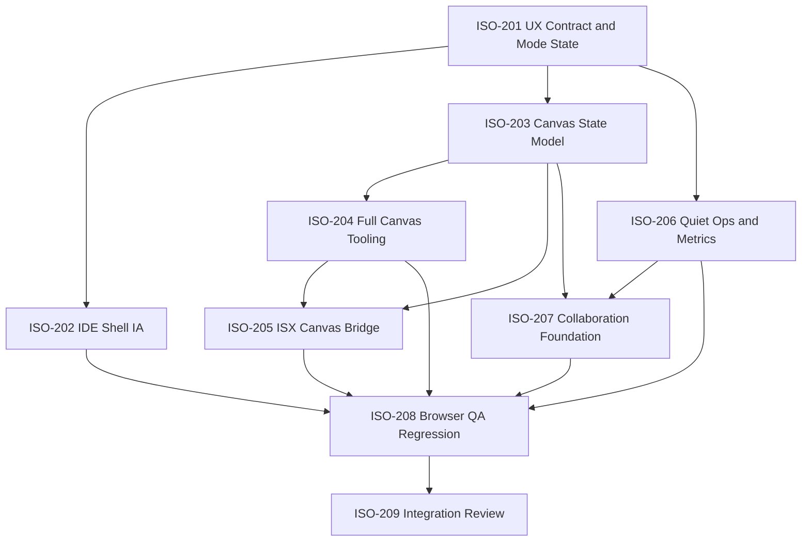

# Isomorph UX Mode Contract Implementation Plan

> **For agentic workers:** REQUIRED: Use superpowers:subagent-driven-development (if subagents available) or superpowers:executing-plans to implement this plan. Steps use checkbox (`- [ ]`) syntax for tracking.

**Goal:** Rebuild Isomorph around two clear work modes: IDE Mode for source-first semantic modeling, and Canvas Mode for edge-to-edge spatial modeling. Keep `.isx` as the strict semantic source of truth, store freeform canvas data in `canvas_state`, hide operational tools until needed, and make telemetry/collaboration/reporting feel invisible and professional.

**Architecture:** A static Vite/React app with mode-specific shells. `App.tsx` owns top-level routing and state composition, focused components own IDE chrome, canvas chrome, right-rail behavior, drawers/modals, and bottom workbench tabs. Domain services own codegen, Supabase persistence, telemetry, collaboration, and canvas serialization. Symphony YAML tasks coordinate isolated worker branches and scripted verification.

**Tech Stack:** React, TypeScript, Vite, Vitest, Playwright, Supabase JS, SVG/canvas rendering already present in the app, repo-local Symphony TypeScript harness.

---

## Product Contract

Isomorph must not be one crowded app. It must expose two deliberate surfaces:

1. **IDE Mode:** precise `.isx` authoring, semantic validation, generated code, project sync, reports, and diagram inspection.
2. **Canvas Mode:** fullscreen spatial diagramming, Excalidraw-like controls, freeform sketching, semantic UML tools, and minimal chrome.

The shared persistence model is:

```text
.isx source        -> strict semantic model
canvas_state JSON  -> viewport, freeform elements, style, collaboration cursors, draft objects
telemetry events   -> metadata and performance/productivity measures only
```

`.isx` corruption is a release blocker. Freeform canvas objects must not force grammar changes in v1. If a canvas action cannot map safely to `.isx`, store it in `canvas_state` and mark it as an unresolved draft object.

## UX Rules

- Source tools live near the source editor.
- Diagram tools live near the diagram.
- Project, account, sync, codegen, metrics, and reports open as modal, drawer, or bottom workbench surfaces.
- Canvas Mode has no IDE header, no footer strip, no permanent sidebars, and no always-visible source editor.
- Telemetry never shows user-facing network failures. It queues, batches, retries, and degrades silently.
- Auth forms use real `<form>` elements, so browser password/autofill behavior is correct.
- Passive event warnings must be fixed at the owning listener boundary, not ignored.

## Target IDE Layout

```text
Top command bar:
Project/file name | Validate | Generate | Share/Sync | Account

Main:
Left project/source rail | ISX editor | Diagram preview | Right diagram rail

Bottom workbench:
Problems | Output | Generated Code | Metrics
```

Right rail states:

```text
Nothing selected  -> Stencils and diagram creation shortcuts
Entity selected   -> Entity properties
Relation selected -> Relation editor
Error selected    -> Fix suggestions and source jump
Canvas selected   -> Style and layout controls
```

Operational surfaces:

```text
Account button    -> Auth/account modal
Share/Sync button -> Cloud files and sync modal
Generate button   -> Generated Code bottom tab or right drawer
Reports button    -> Metrics/report view
```

## Target Canvas Layout

```text
Edge-to-edge diagram canvas
Floating top-left document/status pill
Floating top-center toolbar
Floating top-right collaboration cluster
Floating contextual style strip when selection/tool requires it
Floating right inspector only when selection needs deep editing
```

Primary toolbar:

```text
Lock | Select | Hand | Rectangle | Ellipse | Arrow | Line | Pen | Text | Image | Eraser | More
```

More menu:

```text
Frame | Web embed | Laser pointer | Lasso | UML package/container | Auto-layout | Validate | Export | Source view | Shortcuts
```

Contextual style strip:

```text
Text color | Stroke color | Background | Stroke width | Opacity | Layer/order
```

## Agent Work Rules

- Each worker owns its listed files and should avoid unrelated rewrites.
- If a worker needs to edit another worker's owned file, leave a handoff note in the Symphony task log and keep the edit minimal.
- Use test-first or test-near implementation for domain logic and bug fixes.
- UI workers must run browser QA with screenshots for desktop and mobile.
- Supabase work must keep live credentials out of tests; unit tests use mocked boundaries.
- All tasks finish with their verification commands and a short handoff note.
- Final integration must run `npm run verify` before claiming completion.

## Task Dependency Graph



## Worker Assignments

### Worker A: UX Contract and Mode State

Owned files:

- `src/app/modeState.ts`
- `src/app/workspaceCommands.ts`
- `src/app/selectionState.ts`
- `tests/ux-mode-contract.test.ts`
- `docs/product/isomorph-ux-contract.md`

Steps:

- [ ] Define `WorkspaceMode = "ide" | "canvas"` and route/hash synchronization for `#/app` and `#/canvas`.
- [ ] Define typed command contracts for validate, generate, sync, export, report, share, and mode switch.
- [ ] Define selection state contracts for source, entity, relation, canvas element, error, and none.
- [ ] Document the UX contract in `docs/product/isomorph-ux-contract.md`.
- [ ] Add unit tests for mode transitions, selection-to-rail mapping, and command availability.

Verification:

```powershell
npm test -- --run tests/ux-mode-contract.test.ts
npm run typecheck
```

Acceptance:

- Mode state is typed and testable.
- Canvas route cannot accidentally render IDE chrome.
- IDE command availability is deterministic.

### Worker B: IDE Shell Information Architecture

Owned files:

- `src/App.tsx`
- `src/components/WorkspaceShell.tsx`
- `src/components/TopCommandBar.tsx`
- `src/components/RightDiagramRail.tsx`
- `src/components/BottomWorkbench.tsx`
- `src/components/AuthModal.tsx`
- `src/components/CloudSyncModal.tsx`
- `src/components/CodegenDrawer.tsx`
- `src/components/MetricsDrawer.tsx`
- `src/index.css`
- `tests/components/workspace-shell.test.tsx`

Steps:

- [ ] Remove persistent Cloud, Codegen, and Metrics panels from crowded sidebars.
- [ ] Move diagram stencils/properties to a right rail next to the diagram.
- [ ] Create a compact top command bar with project identity and primary actions.
- [ ] Convert auth UI into a real modal with a real `<form>`.
- [ ] Move generated code into a bottom tab or drawer that opens from Generate.
- [ ] Move metrics into a report drawer/workbench tab, hidden by default.
- [ ] Remove the bottom white footer strip and replace essential status with a small status pill.
- [ ] Add responsive behavior for laptop, desktop, and mobile widths.

Verification:

```powershell
npm test -- --run tests/components/workspace-shell.test.tsx
npm run typecheck
npm run build
```

Acceptance:

- IDE no longer exposes Cloud, Codegen, and Metrics all at once.
- Diagram-specific controls sit on the right.
- Password warning is gone.
- No text overflow or incoherent overlap at common viewport sizes.

### Worker C: Canvas State Model

Owned files:

- `src/canvas/canvasTypes.ts`
- `src/canvas/canvasState.ts`
- `src/canvas/canvasSerialization.ts`
- `src/canvas/canvasTools.ts`
- `src/canvas/canvasStyle.ts`
- `tests/canvas-state.test.ts`

Steps:

- [ ] Define `CanvasState` for viewport, active tool, selection, freeform elements, style defaults, and draft semantic links.
- [ ] Define `CanvasElement` variants for rectangle, ellipse, arrow, line, pen, text, image, eraser mark, frame, embed placeholder, package/container, and laser pointer trail.
- [ ] Add serialization/deserialization with versioning and graceful fallback for unknown future elements.
- [ ] Add immutable reducers for create, update, select, lasso select, lock, layer order, style update, delete, and viewport changes.
- [ ] Keep the state model independent from React rendering.

Verification:

```powershell
npm test -- --run tests/canvas-state.test.ts
npm run typecheck
```

Acceptance:

- Canvas freeform data can be saved as text/JSON beside `.isx`.
- Unknown elements do not crash load.
- The model supports the toolbar tools without touching `.isx` grammar.

### Worker D: Full Canvas Tooling

Owned files:

- `src/components/FullCanvasShell.tsx`
- `src/components/CanvasToolbar.tsx`
- `src/components/CanvasPropertiesStrip.tsx`
- `src/components/CanvasInspector.tsx`
- `src/components/CanvasCollaborationPill.tsx`
- `src/components/DiagramView.tsx`
- `src/index.css`
- `tests/components/full-canvas-shell.test.tsx`

Steps:

- [ ] Rebuild `#/canvas` as a true edge-to-edge fullscreen surface.
- [ ] Add floating toolbar with lock, select, hand, rectangle, ellipse, arrow, line, pen, text, image, eraser, and more.
- [ ] Add More menu with frame, web embed, laser pointer, lasso, UML container, auto-layout, validate, export, source view, and shortcuts.
- [ ] Add contextual style strip for color, background, stroke width, opacity, and layer order.
- [ ] Fix pan/zoom/fit behavior and ensure wheel/touch listeners use correct passive settings.
- [ ] Ensure canvas export uses crisp SVG/PNG scaling and does not render low-quality images.

Verification:

```powershell
npm test -- --run tests/components/full-canvas-shell.test.tsx
npm run typecheck
npm run build
```

Acceptance:

- Canvas has no IDE header/footer/sidebar chrome.
- Toolbar resembles the usability density of Excalidraw without copying code.
- Passive `preventDefault` warnings are gone.
- Export buttons download usable, crisp files.

### Worker E: ISX and Canvas Bridge

Owned files:

- `src/canvas/canvasBridge.ts`
- `src/canvas/isxCanvasCommands.ts`
- `src/services/sourceRewrite.ts`
- `src/services/diagramStore.ts`
- `tests/canvas-bridge.test.ts`
- `tests/source-rewrite-regressions.test.ts`
- `tests/fixtures/isx/broken-edit-regressions.isx`

Steps:

- [ ] Define safe mappings from semantic canvas actions to `.isx` source edits.
- [ ] Store non-semantic/freeform actions in `canvas_state` without modifying `.isx`.
- [ ] Fix relation modal edits so labels, endpoints, multiplicities, and repeated saves cannot corrupt source.
- [ ] Fix component edits for ports, nested nodes, and repeated modal saves.
- [ ] Add regression fixtures for previously broken relation/component edits.
- [ ] Add source rewrite tests that parse after each repeated edit.

Verification:

```powershell
npm test -- --run tests/canvas-bridge.test.ts tests/source-rewrite-regressions.test.ts
npm run typecheck
```

Acceptance:

- Unsafe visual edits never damage `.isx`.
- Repeated relation/component modal saves remain parseable.
- The bridge clearly distinguishes semantic commits from freeform canvas overlay data.

### Worker F: Quiet Operations, Telemetry, and Metrics

Owned files:

- `src/services/telemetry.ts`
- `src/services/metrics.ts`
- `src/services/supabaseClient.ts`
- `src/components/MetricsDrawer.tsx`
- `src/components/StatusPill.tsx`
- `tests/telemetry.test.ts`
- `tests/metrics.test.ts`

Steps:

- [ ] Queue telemetry locally and batch writes to Supabase.
- [ ] Add retry/backoff and offline-safe behavior without user-facing network noise.
- [ ] Track route switches, mode entry/exit, parse/analyze/render/export/save/codegen latency, typing bursts, copy/paste counts, drag duration, relation edits, component edits, and canvas tool usage.
- [ ] Aggregate report metrics: compile latency, save latency, generated LOC, estimated boilerplate time saved, code-vs-diagram time split, lines modified per minute, copy/paste count, export count.
- [ ] Ensure telemetry payloads do not store passwords or full private diagram text.
- [ ] Make Metrics view use event summaries, not only local counters.

Verification:

```powershell
npm test -- --run tests/telemetry.test.ts tests/metrics.test.ts
npm run typecheck
```

Acceptance:

- Failed Supabase telemetry does not clutter console or UI in normal use.
- Metrics are useful for UTM/report-ready claims.
- Copy/paste is only one metric among a full productivity model.

### Worker G: Collaboration Foundation

Owned files:

- `src/collaboration/collaborationTypes.ts`
- `src/collaboration/supabasePresence.ts`
- `src/collaboration/useCollaborationRoom.ts`
- `src/components/ShareModal.tsx`
- `src/components/CanvasCollaborationPill.tsx`
- `supabase/schema.sql`
- `tests/collaboration.test.ts`

Steps:

- [ ] Add collaboration adapter interfaces for presence, broadcast, membership, and future CRDT provider.
- [ ] Implement Supabase Presence for cursors, avatars, active mode, and selected object identifiers.
- [ ] Add share modal with room/document invite model and clear permissions wording.
- [ ] Add schema for memberships/rooms if missing, with RLS-safe policies.
- [ ] Document why Yjs is the next phase for concurrent editing and where it plugs in.
- [ ] Avoid Postgres change feeds for every keystroke or drag.

Verification:

```powershell
npm test -- --run tests/collaboration.test.ts
npm run typecheck
```

Acceptance:

- Real-time foundation supports presence and selection without risky document merges.
- Yjs integration path is explicit but not forced into v1.
- Collaboration UI appears as a lightweight cluster, not another large panel.

### Worker H: Browser QA and Regression Harness

Owned files:

- `tests/e2e/isomorph-ux.spec.ts`
- `tests/e2e/canvas-mode.spec.ts`
- `tests/e2e/export-edit-regressions.spec.ts`
- `tests/fixtures/isx/*.isx`
- `artifacts/qa/.gitkeep`
- `package.json`

Steps:

- [ ] Add browser QA for `/isomorph/app/` and local dev base path.
- [ ] Capture screenshots for IDE desktop, IDE mobile, Canvas desktop, and Canvas mobile.
- [ ] Test codegen drawer, auth modal, metrics drawer, and cloud modal open/close flows.
- [ ] Test SVG/PNG export from class, component, deployment, sequence, and canvas route.
- [ ] Test repeated relation/component edits without source corruption.
- [ ] Test line/file limit messaging for Supabase save boundaries.
- [ ] Write JSONL QA artifacts under ignored `artifacts/qa/`.

Verification:

```powershell
npm run build
npm run verify
```

Acceptance:

- QA validates the actual demo website behavior, not just unit-level confidence.
- Screenshots make UX regressions visible.
- `npm run verify` is the canonical go/no-go command.

### Worker I: Integration Review and Release Gate

Owned files:

- `README.md`
- `docs/qa/isomorph-release-handoff.md`
- `orchestration/tasks/*.yaml`
- `WORKFLOW.md`

Steps:

- [ ] Review all worker branches for conflicting UX or state assumptions.
- [ ] Run one code review pass focused on correctness, `.isx` safety, Supabase safety, and performance.
- [ ] Run one UX review pass using screenshots and console output.
- [ ] Mark Symphony tasks terminal only after verification evidence exists.
- [ ] Update README with launch, app route, Symphony dashboard, Supabase setup, and live QA checklist.
- [ ] Produce final handoff with known limitations and next-phase collaboration plan.

Verification:

```powershell
npm run verify
npm run symphony:status
```

Acceptance:

- No task is marked complete without verification.
- Isomorph launches, the demo route works, and the task tracker reflects the release state.
- Remaining work is explicit, not hidden.

## Cross-Cutting Quality Bar

- TypeScript strictness: no broad `any` unless wrapping third-party payloads at a boundary.
- React state: keep domain reducers pure and testable.
- CSS: no nested cards, no permanent clutter, no text overlap, no one-hue monotone palette.
- Performance: avoid recompiling or re-rendering the full diagram on every small operation when incremental state is enough.
- Security: no service-role keys in frontend, no raw passwords in telemetry, no private source in telemetry event payloads.
- Accessibility: toolbar buttons need labels/tooltips, modals need focus management, forms need submit semantics.

## Final Verification

Run this before claiming the redesign is complete:

```powershell
npm run typecheck
npm test -- --run
npm run build
npm run verify
npm run symphony:check
```

Expected outcome:

```text
All TypeScript checks pass.
All unit/integration tests pass.
Production build succeeds.
Browser QA artifacts are written under artifacts/qa/.
Symphony task definitions parse and dependency graph is valid.
```
